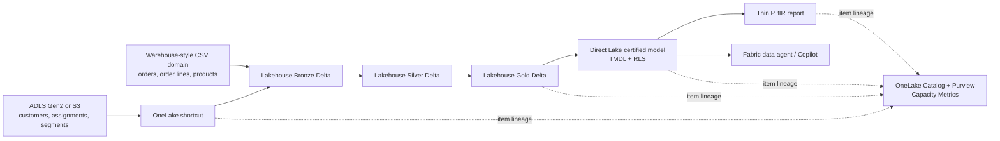

# Microsoft Fabric Motorola RFP proof of concept

Production-oriented, source-controlled Fabric POC for synthetic sales analysis, ask-the-data experiences, governance, and capacity evidence. **No Motorola, customer, proprietary, or sensitive data is included.** Product names, organizations, transactions, and the acronym **PCR ("Priority Communications Revenue") are synthetic POC constructs**.



## What is included

- **Six deterministic source tables in two domains:** warehouse-style orders/order lines/products and object-storage customers/customer-segment assignments/segments.
- **Medallion notebook:** typed ingestion, fail-fast data quality checks, Bronze/Silver/Gold Delta tables, a line-grain sales fact, dimensions, a true customer-to-segment bridge, and a reusable date table.
- **Direct Lake semantic model:** source-controlled PBIP/TMDL, six many-to-one relationships, bidirectional bridge propagation, order-date and ship-date role-playing dimensions, hidden keys, descriptions, three DAX measures, and North America/Europe RLS roles.
- **Thin report:** source-controlled enhanced PBIR with cards, a date chart, and cross-dimension customer/product detail requiring no report-authored joins.
- **Ask the data:** an official source-controlled DataAgent draft definition, agent instructions, approved schema, test prompts, exact deterministic answers, and same-question RLS persona tests.
- **Operations:** official `fabric-cicd` deployment, REST shortcut/job orchestration, preflight, post-deployment checks, safe state-based teardown, field traceability, governance evidence, and a repeatable CU load protocol.

## Local validation

Python 3.10+ and Windows PowerShell 5.1+ are sufficient:

```powershell
python scripts\generate_data.py --output sample-data --customers 120 --orders 900
python -m unittest discover -s tests -v
powershell -NoProfile -ExecutionPolicy Bypass -File scripts\preflight.ps1
```

The generator is deterministic; rerunning it produces the answer values in `ai/test-cases.json`.

## Deployment

1. Copy `.env.example` to `.env`, fill only the values listed in [the runbook](docs/runbook.md), and authenticate `az login`.
2. Install Microsoft-supported deployment tooling: `python -m pip install -r requirements-deploy.txt`.
3. Upload `sample-data\object-storage` to the configured ADLS Gen2/S3 path and create its Fabric cloud connection.
4. Run `scripts\deploy.ps1`. This deploys metadata, uploads warehouse-domain files with AzCopy, creates the external shortcut, and submits the medallion notebook.
5. After the notebook succeeds, run `scripts\deploy-model-report.ps1`, then `scripts\verify-deployment.ps1`. This deploys the model, report, and DataAgent draft; publishing the agent remains a deliberate UI step.
6. Complete the tenant/UI-only controls and evidence checklist in [docs/runbook.md](docs/runbook.md).

Core deployment is idempotent for item IDs already recorded in `.fabric-deploy-state.json`; it refuses to update an unowned item or shortcut with a colliding name. Shortcut creation uses `CreateOrOverwrite` only for the recorded POC shortcut. State is checkpointed after every creation/deletion so interrupted deployment and teardown remain recoverable. Teardown deletes only recorded POC items after verifying their IDs, names, and types. It never deletes the workspace, capacity, cloud connection, or external storage.

**Live deployment status:** not attempted from this repository because tenant credentials, workspace/capacity identifiers, cloud connection, and external storage coordinates are intentionally absent. No successful tenant deployment is claimed.

## Support boundary

As researched from official Microsoft documentation on **2026-09-15**, lakehouse/notebook/item REST support and Direct Lake are generally available, while PBIP/TMDL/PBIR source deployment remains preview. Fabric data agents are GA, but configuration-management/publish APIs are preview; RLS membership, endorsement, Copilot tenant controls, mobile setup, and some AI preparation require tenant UI actions. See [the support matrix](docs/support-matrix.md) and [runbook](docs/runbook.md) for exact boundaries and links.
